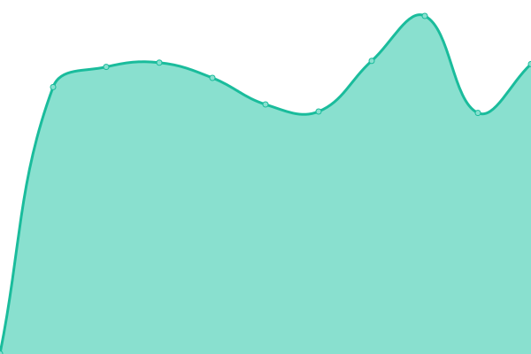
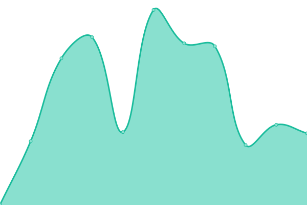
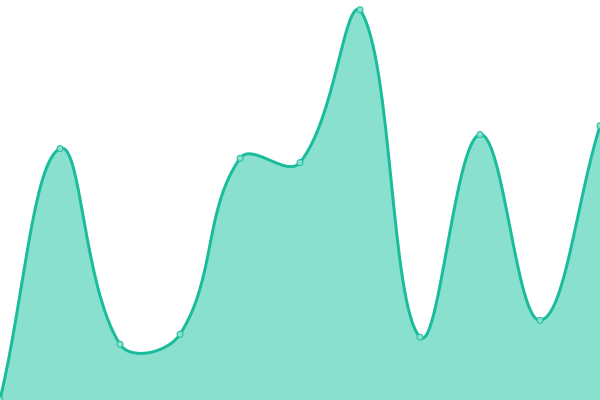
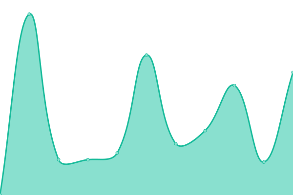
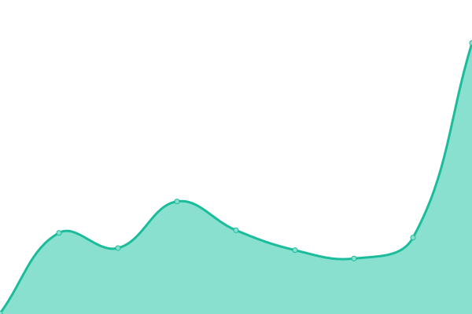

# [📈 Live Status](https://demo.upptime.js.org): <!--live status--> **🟩 All systems operational**

This repository contains the open-source uptime monitor and status page for [Upptime](https://upptime.js.org), powered by [Upptime](https://github.com/upptime/upptime).

With [Upptime](https://upptime.js.org), you can get your own unlimited and free uptime monitor and status page, powered entirely by a GitHub repository. We use [Issues](https://github.com/upptime/upptime/issues) as incident reports, [Actions](https://github.com/upptime/upptime/actions) as uptime monitors, and [Pages](https://demo.upptime.js.org) for the status page.

<!--start: status pages-->
<!-- This summary is generated by Upptime (https://github.com/upptime/upptime) -->
<!-- Do not edit this manually, your changes will be overwritten -->

| URL                                      | Status | History                                                                                      | Response Time                                                                    | Uptime                                                                                                                                                                                                                 |
| ---------------------------------------- | ------ | -------------------------------------------------------------------------------------------- | -------------------------------------------------------------------------------- | ---------------------------------------------------------------------------------------------------------------------------------------------------------------------------------------------------------------------- |
| [LOCALiQ](https://localiq.com)           | 🟩 Up  | [loca-li-q.yml](https://github.com/bigwing/upptime/commits/master/history/loca-li-q.yml)     |  735ms   |      |
| [BigWing](https://bigwing.com)           | 🟩 Up  | [big-wing.yml](https://github.com/bigwing/upptime/commits/master/history/big-wing.yml)       |  380ms    |        |
| [ReachLocal](https://www.reachlocal.com) | 🟩 Up  | [reach-local.yml](https://github.com/bigwing/upptime/commits/master/history/reach-local.yml) |  628ms |  |
| [DesignIQ](https://www.designiq.com)     | 🟩 Up  | [design-iq.yml](https://github.com/bigwing/upptime/commits/master/history/design-iq.yml)     |  174ms   |      |
| [ThriveHive](https://thrivehive.com)     | 🟩 Up  | [thrive-hive.yml](https://github.com/bigwing/upptime/commits/master/history/thrive-hive.yml) |  256ms |  |

<!--end: status pages-->

[**Visit our status website →**](https://demo.upptime.js.org)

## 📄 License

- Code: [MIT](./LICENSE) © [Upptime](https://upptime.js.org)
- Data in the `./history` directory: [Open Database License](https://opendatacommons.org/licenses/odbl/1-0/)
