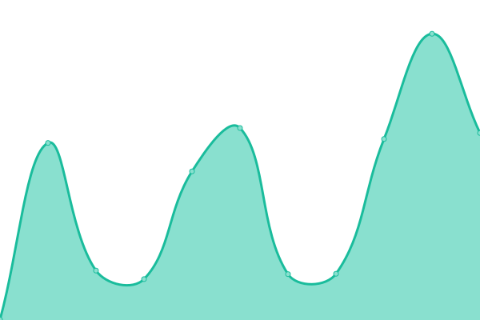

# [📈 Live Status](https://demo.upptime.js.org): <!--live status--> **🟩 All systems operational**

This repository contains the open-source uptime monitor and status page for [Upptime](https://upptime.js.org), powered by [Upptime](https://github.com/upptime/upptime).

With [Upptime](https://upptime.js.org), you can get your own unlimited and free uptime monitor and status page, powered entirely by a GitHub repository. We use [Issues](https://github.com/upptime/upptime/issues) as incident reports, [Actions](https://github.com/upptime/upptime/actions) as uptime monitors, and [Pages](https://demo.upptime.js.org) for the status page.

<!--start: status pages-->
<!-- This summary is generated by Upptime (https://github.com/upptime/upptime) -->
<!-- Do not edit this manually, your changes will be overwritten -->
<!-- prettier-ignore -->
| URL | Status | History | Response Time | Uptime |
| --- | ------ | ------- | ------------- | ------ |
| [LOCALiQ](https://localiq.com) | 🟩 Up | [loca-li-q.yml](https://github.com/bigwing/upptime/commits/master/history/loca-li-q.yml) | 

 774ms
     
 | 

   

| [BigWing](https://bigwing.com) | 🟩 Up | [big-wing.yml](https://github.com/bigwing/upptime/commits/master/history/big-wing.yml) | 

 403ms
     
 | 

   

| [ReachLocal](https://www.reachlocal.com) | 🟩 Up | [reach-local.yml](https://github.com/bigwing/upptime/commits/master/history/reach-local.yml) | 

 569ms
     
 | 

   

| [DesignIQ](https://www.designiq.com) | 🟩 Up | [design-iq.yml](https://github.com/bigwing/upptime/commits/master/history/design-iq.yml) | 

 332ms
     
 | 

   

| [ThriveHive](https://thrivehive.com) | 🟩 Up | [thrive-hive.yml](https://github.com/bigwing/upptime/commits/master/history/thrive-hive.yml) | 

 293ms
     
 | 

   

<!--end: status pages-->

[**Visit our status website →**](https://demo.upptime.js.org)

## 📄 License

- Code: [MIT](./LICENSE) © [Upptime](https://upptime.js.org)
- Data in the `./history` directory: [Open Database License](https://opendatacommons.org/licenses/odbl/1-0/)
